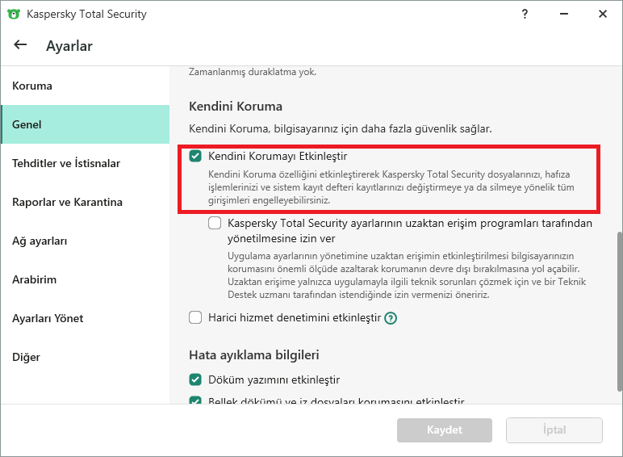
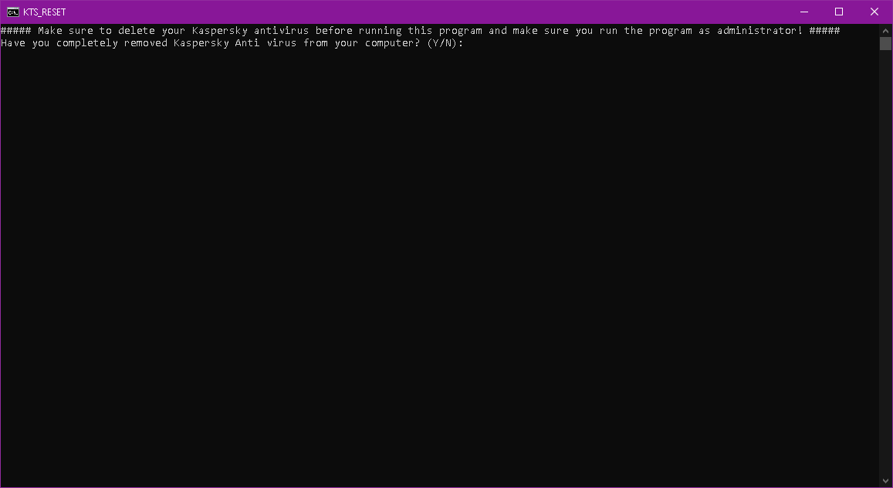

<h1>KTS RESET TOOL</h1>

<h3># 30-day trial reset tool for Kaspersky antivirus software.

# How to use

>`Important Note:` Note that you must run the program as an administrator before opening the program!

First, open the Kaspersky program. After you open it, go to the settings by clicking the gear icon in the lower left. Then click on the general option and disable the "Self Protection" option.

After completing these steps, right click on the icon of the kaspersky program and click exit and close the program.

Then there are a few options you can apply. The first of these options is to uninstall kaspersky with any application uninstaller software (the reason we uninstall using an application is to automatically clean the registry remnants [Regedit]. If I need to recommend an application you can use for this, you can use [IObit Uninstaller](https://www.iobit.com/en/advanceduninstaller.php).) or you can simply Uninstall Kaspersky from the control panel , but for stability it is better to do the first step.

After successfully uninstalling the kaspersky program, run the KTS_RESET.bat file. You can use the program according to the warnings and articles written later.

After the program has done its job successfully, a notification will appear on your screen and your computer will restart automatically.

 After you have successfully completed all the steps, download and install the same kaspersky program you use from the internet and enjoy your 30-day trial version.

>`Important Note:` All operations here are legal. This program is only tricking the program to renew the 30-day trial version of kaspersky.
